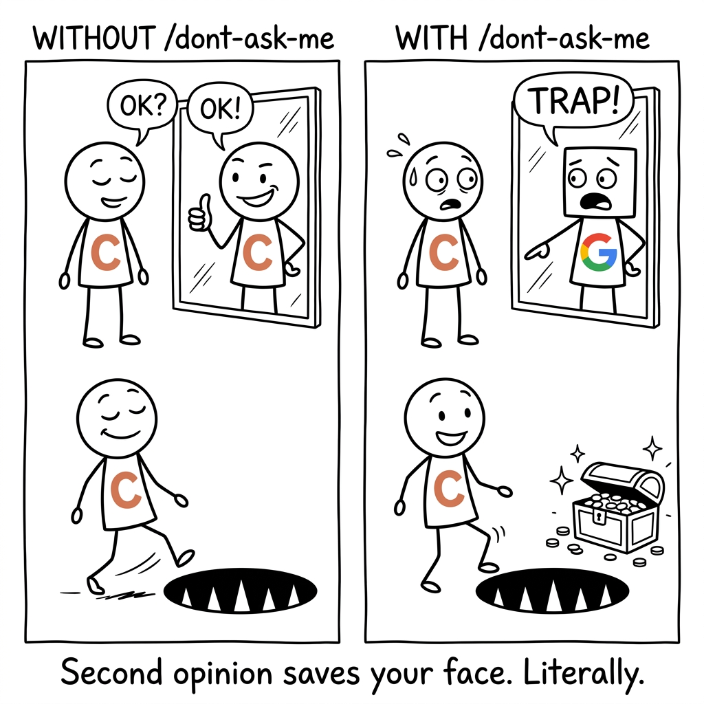
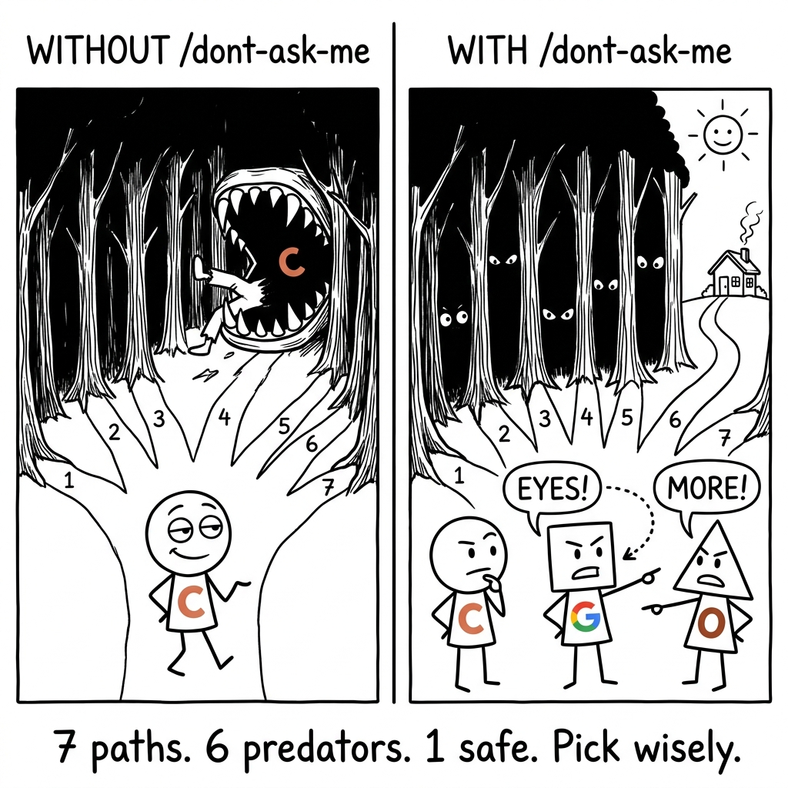
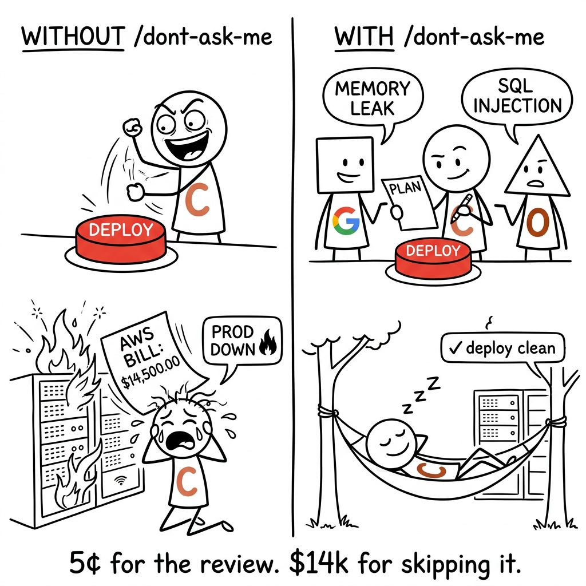
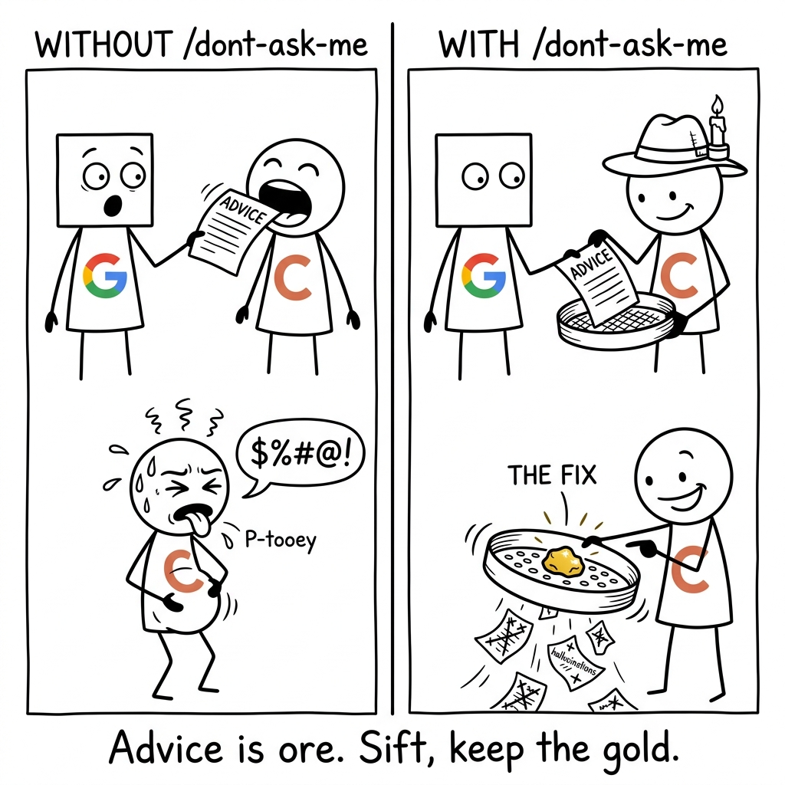

<div align="center">


# Don't Ask Me

**Cross-check Claude's answer with a second AI before you trust it.**

</div>

---









---

## Install

```
/plugin marketplace add awrshift/skill-dont-ask-me
```

Then set your Gemini key (free tier at [aistudio.google.com](https://aistudio.google.com)):

```bash
echo 'GOOGLE_API_KEY=your_key_here' >> ~/.env
pip install google-genai
```

## Three modes — Claude picks one based on what you type

| Mode | Trigger phrase | What happens |
|---|---|---|
| **Second opinion** | *"sanity check"*, *"am I missing something"* | One reviewer (Gemini or isolated Claude). ~3¢ |
| **Full review** | *"this is important"*, *"run a full review"* | Both reviewers in parallel. ~7¢ |
| **Group discussion** | *"help me choose"*, *"brainstorm options"* | 3-round debate. ~25¢ |

## Just say what you need — no exact phrases required

Claude reads your intent and picks the right mode. Some natural ways to trigger each:

**Want a quick sanity check?**
> *"sanity check this"* · *"am I missing something"* · *"stress-test this"* · *"critique this"* · *"give me a second opinion"* · *"cross-check this"* · *"review this"* · *"thoughts?"* · *"is this right?"* · *"devil's advocate"* · *"poke holes in this"* · *"what could go wrong"*

**High-stakes, want both reviewers?**
> *"this is important"* · *"run a full review"* · *"check before I send"* · *"before publishing"* · *"big decision"* · *"high-stakes review"* · *"boardroom debate"* · *"dual validation"* · *"two independent opinions"* · *"don't let me ship something dumb"* · *"this can't be wrong"*

**Choosing between options?**
> *"help me choose between"* · *"brainstorm options"* · *"I have several paths"* · *"I have 3 angles on this"* · *"multiple options to weigh"* · *"diverge and converge"* · *"multi-round brainstorm"* · *"round-table discussion"* · *"compare these approaches"* · *"what's the best direction"*

**Calling a model directly?**
> *"ask Gemini"* · *"ask Opus"* · *"what would Gemini say"* · *"let's get a second model on this"* · *"another perspective please"*

If none of these fit, just describe what you're stuck on. Claude figures out which mode helps.

## Full docs

[**SKILL.md**](SKILL.md) — how it works, when to invoke, anti-patterns, CLI reference.

## License

MIT. PRs welcome.
